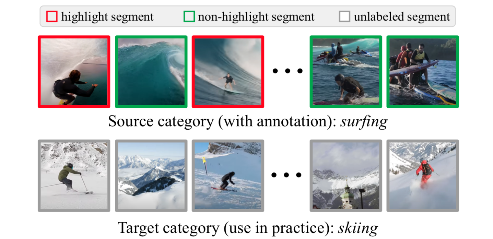

# Cross-category Video Highlight Detection via Set-based Learning

<p align="center">
   
</p>

## Introduction

This project is an implementation of ``Cross-category Video Highlight Detection via Set-based Learning'' in PyTorch, which is accepted by *ICCV 2021*. 
We provide the codes for our proposed *SL-module*, *DL-VHD* and also some domain adaptation baselines in this repository.

More details of this work can be found in our paper: [[Paper (arXiv)]](). 

## Prerequisites

We develop this project with `Python3.6` and following Python packages:
```
Pytorch                   1.5.0
cv2                       3.4.2
einops                    0.3.0
```
**P.S.** In our project, these packages can be successfully installed and work together under `CUDA/9.0` and `cuDNN/7.0.5`.

## Dataset and Pre-trained Model

**YouTube Highlights dataset.** You can download the dataset in [this repository](https://github.com/aliensunmin/DomainSpecificHighlight) and put it under the path you like, e.g. `~/data/YouTube_Highlights/`. 

For training highlight detection models, you can convert the original videos in YouTube Highlights to video segments by following command:
```
python ./dataloaders/youtube_highlights_set.py
```

**ActivityNet dataset.** Because of the large size of the full dataset, we suggest you to crawl videos using [this tool](https://github.com/activitynet/ActivityNet/tree/master/Crawler). We provide the names of the videos used in our work in [this file](https://github.com/ChrisAllenMing/Cross_Category_Video_Highlight/blob/main/data_process/data_info/ActivityNet_vids.txt). 
You can put the crawled videos under the path you like, e.g. `~/data/ActivityNet/`.

To fit the format of highlight detection, you can convert the raw videos and annotations by following commands:
```
cd ./data_process
python process_ActivityNet.py
```

**Pre-trained model.** You can download the pre-trained C3D model in [this link](https://drive.google.com/file/d/19NWziHWh1LgCcHU34geoKwYezAogv9fX/view?usp=sharing) and put it under the path you like, e.g. `~/pretrained_models/`.

## Category-specific Video Highlight Detection

**SL-module.** To train and finally evaluate the SL-module, simply run: 
```
python train_SL_module.py --gpu_id $device_id$ --src_category $cls$ \
                          --tgt_category $cls$ --use_transformer
```

## Cross-category Video Highlight Detection

**Source-only.** To train and finally evaluate the Source-only model with SL-module, simply run:
```
python train_SL_module.py --gpu_id $device_id$ --src_category $src_cls$ \
                          --tgt_category $tgt_cls$ --use_transformer
```

**Target-oracle.** To train and finally evaluate the Target-oracle model with SL-module, simply run:
```
python train_SL_module.py --gpu_id $device_id$ --src_category $tgt_cls$ \
                          --tgt_category $tgt_cls$ --use_transformer
```

**DA baselines.** To train and finally evaluate two domain adaptation baselines (MMD and Deep CORAL), simply run:
```
python train_da_baselines.py --gpu_id $device_id$ --src_category $src_cls$ \
                             --tgt_category $tgt_cls$ --da_metric $mmd/coral$ \
                             --use_transformer
```

**DL-VHD.** To train and finally evaluate the DL-VHD model, simply run:
```
python train_dual_learner.py --gpu_id $device_id$ --src_category $src_cls$ \
                             --tgt_category $tgt_cls$ --use_transformer
```

## Citation

If this work helps your research, you can kindly cite the following paper (will be updated when the ICCV paper is published).

```
@article{xu2021cross-category,
  title={Cross-category Video Highlight Detection via Set-based Learning},
  author={Xu, Minghao and Wang, Hang and Ni, Bingbing and Zhu, Riheng and Sun Zhenbang and Wang Changhu},
  journal={arXiv preprint arXiv:},
  year={2021}
}
```